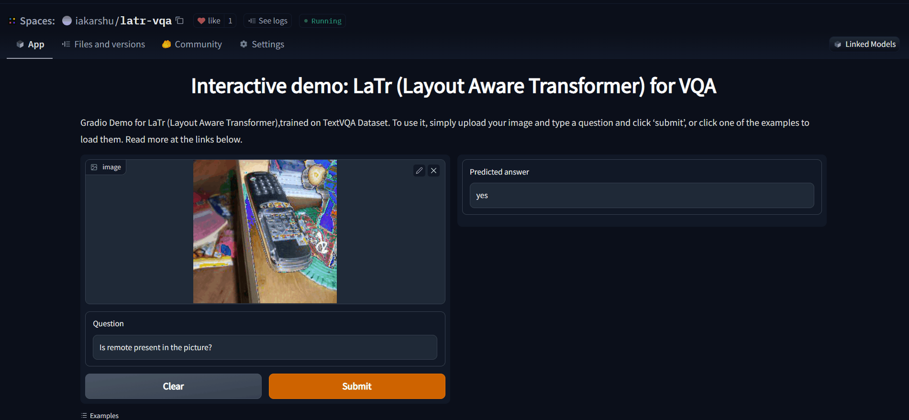

# LaTr - PyTorch


Implementation of [LaTr: Layout-aware transformer for scene-text VQA](https://arxiv.org/abs/2112.12494),a novel multimodal architecture for Scene Text Visual Question Answering (STVQA).

LaTr improves robustness towards OCR errors, a common reason for failure cases in STVQA. In addition, by leveraging a vision transformer, LaTr eliminate the need for an external object detector. LaTr outperforms state-of-the-art STVQA methods on multiple datasets. In particular, +7.6% on TextVQA, +10.8% on ST-VQA and +4.0% on OCR-VQA (all absolute accuracy numbers).

The official implementation was not released by the authors.


NOTE: I have tried my best to implement this paper, and have taken minimum assumptions while implementing, but, one of the essential part of any implementation is to provide pre-trained weights and show the results of your implementation on the dataset mentioned in the paper, however due to resource limitation from my side, I won't be able to provide pre-trained weights. However, I would try to include scripts in the example, so that if someone has the resources, they can use the scripts to obtain pre-trained weights and share it. Open to all feedbacks, and hope this implementation turns out to be useful to the community.

## Demo


An interactive demo for the same can be found out [here](https://huggingface.co/spaces/iakarshu/latr-vqa)

## Install

```python
pip install transformers
pip install sentencepiece==0.1.91
pip install pytesseract
sudo apt install tesseract-ocr
pip install 'Pillow==7.1.2'
```

## Usage

* For pre-training task: Refer [here](https://github.com/uakarsh/latr/blob/main/examples/LaTr_PreTraining.ipynb)
* The training of LaTr from scratch with PyTorch Lightening can be referred [here](https://github.com/uakarsh/latr/tree/main/examples/textvqa)


## Results:

Currently, I used the following configurations:

```python
classes : 32128
hidden_state: 768
max_2d_position_embeddings: 1001
seq_len: 512
t5_model: "t5-base"
vocab_size: 32128
hidden_state: 768
learning_rate: 0.0001
max_2d_position_embeddings: 1001
max_steps: 50000
seq_len: 512
t5_model: "t5-base"
vocab_size: 32128
batch size: 1  (I think, this is a major difference between the training of mine and authors)
```

And have been able to obtain a validation accuracy of: 27.42 percentage (authors were able to achieve 44.03 percentage)

* The results of all the experiments can be found out [here](https://wandb.ai/iakarshu/VQA%20with%20LaTr?workspace=), note that I was not able to save the checkpoint of that (some kaggle error), but I initialized the weights from [here](https://www.kaggleusercontent.com/kf/99663112/eyJhbGciOiJkaXIiLCJlbmMiOiJBMTI4Q0JDLUhTMjU2In0..JDENcUm0rUk0qGihFn1QuQ.wKuoRF1z1AmNCwFoZJN3SSFRMNKRvZLlGhzAykt7njLW3OUwV-TQCk9fbUx27ITQ6TpBWeYZl7G3mVorvDQquZfcYHoFam8yZpZ1zl9hmX_YQdZ1KtNrlMv0mKCpr2r6QH7WtUCbi0nWOG3R_31GJHV42pyUXJ1EII9KgnSmjKcTVNjRl7SdrwVnUW8caVtGDTZeMZuS8HH1T_-6pInZMwaZvekEvRqgIM2TArZH-0OVwIszKdfbQftcPz2f9NzpSHeu9bq6ZxhjUcUTCdNJxeNeIcxv4jnfTW146_r_zzmt4SWo8QSsG-zQAPAsxv5JL9nZiP65OUe4uNeWSO-t4ChzpRkUQLnv01ptWkzK0p9j00-xIlC36F5mXXtpbvLHlLXvkBKlrJ4NKEN76RdYAv77sbwoMQZ8RVHRj7-QYcBzaPZgTUNlRi65FnA30v0_UZIMreHyN0H1K7Kdj34TS8_pY058rYVhQY9avwuc32krDOoSG-sQ2FZA7Nvs5CoH0H6ejyvrsMMhCBbROkZDiD0jzeKwlPi-267OqjEMsKar77LsDgzkhccxp6Zgr8ZHTkEnVE553A8Yz7J76Q5vFx-M1ZXhoJIVfZcdSSpoI_jih7woeLdJVWIvctvE1aof88M1PmHPmB9qS2V9S10tK1MBIGeay06xW83d9dd5qD93ugxKZISxEg-IJddlSuII.o1fCKlUduAUrwtk1ANYLug/models/epoch=0-step=34602.ckpt)

The same weights can be downloaded by the command as follows:
```
pip install gdown
gdown 192-AETChd2FoNfut0hkLRwcLMfd5-uIj
```

* The script of the same can be found out [here](https://www.kaggle.com/code/akarshu121/latr-textvqa-training-with-wandb)

##  License

MIT

## Maintainers

- [uakarsh](https://github.com/uakarsh)

## Contribute


## Citations

```bibtex
@misc{https://doi.org/10.48550/arxiv.2112.12494,
  doi = {10.48550/ARXIV.2112.12494},
  url = {https://arxiv.org/abs/2112.12494},
  author = {Biten, Ali Furkan and Litman, Ron and Xie, Yusheng and Appalaraju, Srikar and Manmatha, R.},
  keywords = {Computer Vision and Pattern Recognition (cs.CV), FOS: Computer and information sciences, FOS: Computer and information sciences},
  title = {LaTr: Layout-Aware Transformer for Scene-Text VQA},
  publisher = {arXiv},
  year = {2021},
  copyright = {Creative Commons Attribution 4.0 International}
}
```
